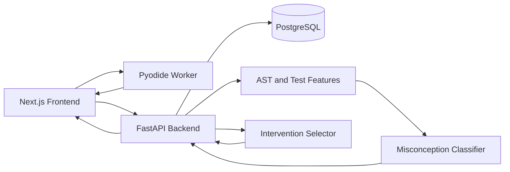

# Re:Learn system architecture

## Scope

The hackathon system is designed as a modular monolith with three future application areas: `relearn-web` for the Next.js experience, `relearn-api` for the FastAPI application, and `relearn-ml` for dataset preparation, training, evaluation, and classifier artifacts. PostgreSQL remains the source of truth. Only `relearn-web` is implemented in the current scaffold.

```text
relearn/
├── relearn-web/       # Next.js frontend (implemented now)
├── relearn-api/       # FastAPI modular monolith (planned)
├── relearn-ml/        # Training and model inference artifacts (planned)
├── data/              # Reviewed misconception datasets (planned)
├── docs/
│   ├── ARCHITECTURE.md
│   └── API_CONTRACTS.md
└── infra/             # Container and deployment configuration (planned)
```

## System overview



### Frontend

Next.js 16, React 19, TypeScript, and the App Router provide the learner experience. The frontend displays exercises, hosts the editor, runs predefined Python tests, submits normalized attempt evidence, presents friendly diagnoses, launches targeted mini-games, shows reassessments, and tracks visible progress, quests, and XP.

Untrusted learner code never runs on the application server. A future Pyodide adapter will run in a dedicated Web Worker with predefined tests and strict time limits. The current boundary is defined in `relearn-web/lib/code-runner.ts`. All backend access goes through the typed `relearn-web/lib/api.ts` module and the `NEXT_PUBLIC_API_BASE_URL` configuration value.

### FastAPI modular monolith

The future backend uses Python, FastAPI, Pydantic, SQLAlchemy 2, Alembic, and PostgreSQL. It owns exercises, attempts, normalized classifier input, diagnoses, interventions, reassessments, mastery rules, XP, quests, progress, and model metrics. The classifier remains behind this API rather than being exposed to the browser.

Planned modules:

```text
relearn-api/app/
├── main.py, config.py, database.py
├── api/          # exercises, attempts, diagnoses, interventions, progress, quests
├── models/       # relational SQLAlchemy models
├── schemas/      # Pydantic request and response models
├── services/     # diagnosis, intervention, progress, and quest rules
├── repositories/ # persistence boundaries
└── migrations/   # Alembic revisions
```

This remains one deployable application for the hackathon. Module boundaries support later growth without introducing operationally expensive microservices.

### Misconception classifier

The primary trained artifact is a misconception classifier, not a generative model. Input combines the exercise prompt, submitted Python, test results, extracted AST features, and an optional learner explanation. Output includes a label, calibrated confidence, per-class probabilities, structured evidence, and model version.

Initial classes are `CORRECT`, `RANGE_ENDPOINT_EXCLUDED`, `WRONG_INITIALIZATION`, `ACCUMULATOR_OVERWRITTEN`, `WRONG_OR_MISSING_UPDATE`, and `VARIABLE_ROLE_CONFUSION`. The inference service returns `UNCERTAIN` when confidence is below its threshold or the two most likely predictions are too close.

The planned pipeline imports selected McMiner samples, chooses beginner MBPP problem families, adds manually reviewed examples, extracts AST and test-signature features, trains a TF-IDF plus logistic-regression baseline, optionally compares frozen CodeBERT embeddings plus logistic regression, calibrates probabilities, and evaluates on held-out problem families. Every diagnosis stores its model version and confidence.

Gemini may eventually personalize explanation wording. Structured model output and deterministic application logic—not free-form generation—choose the misconception and intervention.

## End-to-end data flow

1. The frontend requests an exercise.
2. The learner writes Python code.
3. a restricted Pyodide Worker executes predefined tests in the browser.
4. The frontend submits code, test results, and an optional explanation to FastAPI.
5. FastAPI stores the attempt in PostgreSQL.
6. The backend extracts or validates AST features.
7. The classifier returns a label, probabilities, evidence, model version, and confidence.
8. FastAPI stores the diagnosis and deterministically selects a targeted intervention.
9. The frontend translates the result into friendly learner-facing language and a mini-game.
10. Completing the mini-game causes the backend to assign a transfer exercise.
11. The learner submits the transfer attempt.
12. The classifier and deterministic mastery rules assess the new evidence.
13. PostgreSQL updates concept state, XP, and quest progress.
14. The dashboard fetches the updated learning plan.

Internal codes never appear directly in learner-facing UI. They map to reviewed names, descriptions, and game types at the application boundary.

## PostgreSQL model

| Table | Core columns |
|---|---|
| `learners` | `id`, `display_name`, `avatar`, `xp`, `streak`, `created_at` |
| `concepts` | `id`, `code`, `name`, `description`, `display_order` |
| `misconceptions` | `id`, `code`, `learner_friendly_name`, `internal_description`, `intervention_type` |
| `exercises` | `id`, `concept_id`, `title`, `prompt`, `difficulty`, `starter_code`, `test_cases JSONB`, `exercise_type` |
| `attempts` | `id`, `learner_id`, `exercise_id`, `parent_attempt_id`, `attempt_type`, `submitted_code`, `learner_explanation`, `test_results JSONB`, `created_at` |
| `diagnoses` | `id`, `attempt_id`, `misconception_id`, `model_version_id`, `confidence`, `class_probabilities JSONB`, `evidence JSONB`, `created_at` |
| `interventions` | `id`, `diagnosis_id`, `intervention_type`, `content JSONB`, `completed_at` |
| `learner_concept_states` | `id`, `learner_id`, `concept_id`, `misconception_id`, `status`, `evidence_count`, `mastery_score`, `last_attempt_id`, `updated_at` |
| `quests` | `id`, `title`, `description`, `xp_reward`, `quest_type`, `requirements JSONB` |
| `learner_quests` | `learner_id`, `quest_id`, `status`, `progress`, `completed_at` |
| `model_versions` | `id`, `name`, `dataset_version`, `artifact_path`, `metrics JSONB`, `created_at` |

`JSONB` is reserved for evolving structures such as tests, probabilities, evidence, requirements, content, and metrics. Searchable identifiers, statuses, relations, timestamps, and scores remain normal relational columns.

## Assessing resolution

A correct retry alone does not resolve a misconception. The service collects a near-transfer answer, a far-transfer answer, their test results, new diagnoses, and optionally the learner’s reasoning.

| Evidence | Next state |
|---|---|
| Same misconception appears again | `NEEDS_PRACTICE` |
| Correct near-transfer answer only | `IMPROVING` |
| Correct near- and far-transfer answers, no repeated misconception | `RESOLVED` |
| Conflicting or low-confidence evidence | Retain previous state |

New concepts begin as `UNTESTED`. State changes are deterministic and auditable; generated explanation text never changes mastery state.

## Architectural principles

- Optimize for a modular monolith during the hackathon.
- Keep the classifier private behind FastAPI and PostgreSQL authoritative.
- Run untrusted learner code only in a restricted browser worker.
- Store model version, confidence, probabilities, and evidence with every diagnosis.
- Select games deterministically from the misconception code.
- Separate internal codes from reviewed learner-friendly language.
- Keep frontend components independent of mock and transport implementations.
